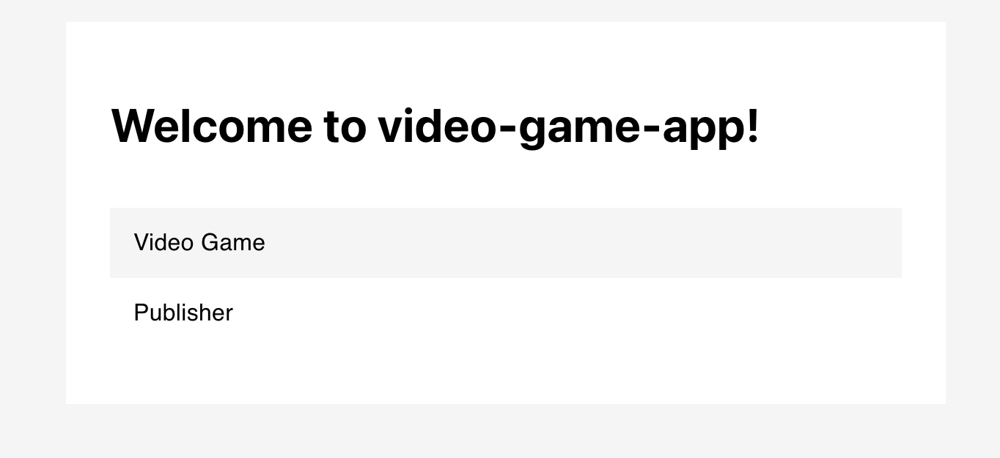

# create-app

Generate an application form a simple json configuration. Perfect for MVP's and admin sites. Built on ideas from smalltalk and other data-model driven application creation.

## Status

Pre-alpha. Marching towards alpha.  
Generated react app is runnable with add model instance and homepage.



See [change log](./doc/CHANGELOG.md) for more details.

## Getting started

### Environment Requirements

```
1. Yarn
2. Node >= 14.x
```

### Install

```
1. clone repo
2. $ yarn install
3. $ yarn link
```

### Usage

```bash
$ create-app config.json
```

config.json

```json
{
  "name": "test-app",
  "template": "test"
}
```

## Config

| Property | Description                                                                  | Default                         |
| -------- | ---------------------------------------------------------------------------- | ------------------------------- |
| name     | The name of your app                                                         | app                             |
| template | What type of app you are creating, can be react or test                      | react-app                       |
| dir      | The relative directory the app will be created in                            | /                               |
| ui       | Specify what UI you would like, values depend on the template                | default depends on the template |
| api      | Specify what API you would like, values depend on the template               | default depends on the template |
| db       | Specify what DB you would like, values depend on the template                | default depends on the template |
| models   | The data and relationships that make up your app, see below for more details | {}                              |

### Models

| Property          | Description                 | Default |
| ----------------- | --------------------------- | ------- |
| _your model name_ | The defintion of your model | {}      |

### Model

| Property             | Description          | Default  |
| -------------------- | -------------------- | -------- |
| _your property name_ | type of the property | "String" |

### Template

Each template has its own set of options for ui, api and db, which change how the app is constucted.

**react-app**
| Property | options | Default |
| ------------- | ------------- | -----
| ui | react | react
| api | indexedDB, stub | indexedDB
| db | indexedDB, none | indexedDB

_more options coming_

## Example config

```
{
  "name": "video-game-app",
  "template": "react-app",
  "models": {
    "Video Game": {
      "Title": "String",
      "Year Published": "String"
    },
    "Publisher": {
      "Name": "String"
    }
  }
}
```

## Contributors welcome

This project is in early stages and looking for contributers. See [design](./doc/DESIGN.md).

## Goals

Aim for progressive development with something useful asap See the [road map](./doc/ROADMAP.md).

## Todo

- add model collection view
- add model remove
- add github test badge
- add github test action (pipeline)
- add overide cli option, for now this can just delete the existing dir
- add options cli option, print out options from manfesto
- add test for missing coverage
- try to fix nested app issue (apps don't run from manual folder)
- Make docs easier to understand
- Fix tabing in .create-app
- remove component logic from view model
- rebrand
